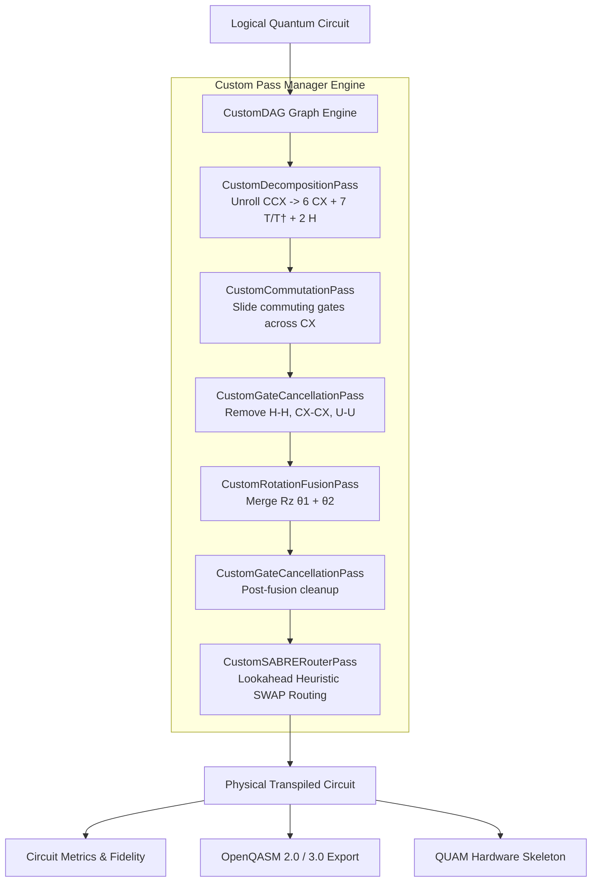

# ⚡ Quantum Circuit Optimizer

<div align="center">


**A from-scratch, educational, and production-ready Quantum Transpiler engine & optimization framework with custom DAG representation, gate cancellation, continuous rotation fusion, commutation analysis, SABRE hardware routing, and OpenQASM / QUAM export.**

[Features](#-key-features) •
[Architecture](#-transpiler-architecture--flow) •
[Quickstart](#-quickstart) •
[Interactive Examples](#-run-interactive-examples) •
[Custom Passes](#-custom-transpiler-passes--engine) •
[Module Breakdown](#-module-breakdown) •
[Testing](#-testing) •
[Roadmap](#-future-roadmap)

</div>

---

## 🌟 Key Features

- **100% From-Scratch Transpiler Engine**: Built our own compiler pass infrastructure (`CustomPassManager`, `TransformationPass`, `AnalysisPass`, `PropertySet`) without calling Qiskit's internal transpiler passes as a black box.
- **Custom DAG Graph Engine**: Native pure-Python Directed Acyclic Graph (`CustomDAG`, `DAGNode`) with wire tracking, node splicing, edge rewiring, and critical path depth calculation.
- **Algebraic Gate Cancellation**: Traverses DAG wires to eliminate self-inverse pairs ($H \cdot H \to I$, $X \cdot X \to I$, $CX \cdot CX \to I$, $U(\pi,0,\pi) \cdot U(\pi,0,\pi) \to I$) and adjoint pairs ($T \cdot T^\dagger \to I$, $S \cdot S^\dagger \to I$).
- **Continuous Rotation Fusion**: Combines contiguous single-qubit rotations ($R_z(\theta_1) \cdot R_z(\theta_2) \to R_z(\theta_1 + \theta_2)$) modulo $2\pi$, cleanly dropping identities when $\theta_1 + \theta_2 \approx 0$.
- **Commutation Analysis**: Slides commuting operations (e.g. $Z$-gates through $CX$ control, $X$-gates through $CX$ target) forward along wires to unlock hidden cancellation opportunities.
- **Rule-Based Decomposition**: Decomposes multi-qubit gates into native basis sets (canonical 6-CX Toffoli / CCX decomposition, $SWAP \to 3\ CX$, $CZ \to H + CX + H$).
- **Custom SABRE SWAP Routing**: Full implementation of the SABRE heuristic lookahead search algorithm with distance matrices (BFS), front layer ($F$), lookahead window ($E$), and decay penalty factors.
- **OpenQASM & QUAM Export**: Clean dual export to OpenQASM 2.0 and OpenQASM 3.0, along with Quantum Machines QUAM hardware configuration skeletons.

---

## 🏗️ Transpiler Architecture & Flow



---

## 🚀 Quickstart

### 1. Installation

Clone this repository and set up your Python environment:

```bash
git clone https://github.com/Babin123456/Quantum-Circuit-Optimizer.git
cd Quantum-Circuit-Optimizer

# Create virtual environment (Python 3.10 - 3.12 recommended)
uv venv --python 3.12 .venv
# On Windows: .venv\Scripts\activate
# On Linux/macOS: source .venv/bin/activate

# Install dependencies and local package in editable mode
uv pip install -r requirements.txt
uv pip install -e .
```

### 2. Optimize in 5 Lines of Code

```python
from qiskit import QuantumCircuit
from quantum_optimizer import QuantumOptimizer, compare_circuits

# Create circuit with redundant operations
qc = QuantumCircuit(2)
qc.h(0)
qc.h(0)        # Cancels: H * H = I
qc.cx(0, 1)

# Optimize circuit with our custom transpiler
optimizer = QuantumOptimizer(optimization_level=2)
optimized_qc = optimizer.optimize(qc)

# Inspect reductions
metrics = compare_circuits(qc, optimized_qc)
print(f"Depth reduction: {metrics['depth_reduction_pct']}%")
print(f"Gate count reduction: {metrics['gate_reduction_pct']}%")
```

---

## 🧩 Custom Transpiler Passes & Engine

Our custom transpiler is modular and extensible:

### Building a Custom Pass Pipeline
```python
from quantum_optimizer.transpiler import (
    CustomPassManager,
    CustomGateCancellationPass,
    CustomRotationFusionPass,
    CustomCommutationPass,
    CustomDecompositionPass,
)

# Assemble your own custom compiler passes
pm = CustomPassManager([
    CustomDecompositionPass(),
    CustomCommutationPass(),
    CustomGateCancellationPass(),
    CustomRotationFusionPass(),
    CustomGateCancellationPass(),
])

# Run over circuit
optimized_qc = pm.run(qc)
```

### The Custom SABRE Routing Heuristic
The `CustomSABRERouterPass` implements the heuristic cost function:

$$\text{Cost}(S) = \frac{1}{|F|} \sum_{(u, v) \in F} D(\pi(u), \pi(v)) + W \cdot \frac{1}{|E|} \sum_{(u, v) \in E} D(\pi(u), \pi(v))$$

Where:
- $F$ is the **Front Layer** of currently executable gates.
- $E$ is the **Extended Lookahead Window** of downstream gates.
- $D(p, q)$ is the shortest path distance on the hardware coupling map computed via BFS.
- $W$ is the lookahead weight (default: $0.5$).
- Decay factors $\delta(p)$ are applied to recently swapped qubits to avoid livelocks and ping-pong cycles.

---

## 💻 Run Interactive Examples

The repository includes ready-to-run educational scripts in `examples/`:

### Example 1: Basic Optimization & Gate Cancellation
```bash
uv run python examples/01_basic_optimization.py
```
*Demonstrates single-qubit gate cancellation, 2-qubit CX cancellation, and multi-level comparison.*

### Example 2: Toffoli Gate Decomposition & Cancellation
```bash
uv run python examples/02_toffoli_decomposition.py
```
*Recreates canonical 6-CX Toffoli decomposition, eliminates adjacent redundant $U(\pi,0,\pi)$ rotations, and verifies unitary equivalence ($F = 1.000000$).*

### Example 3: Hardware Topology & SABRE Routing
```bash
uv run python examples/03_sabre_hardware_routing.py
```
*Maps an unconstrained circuit onto a 5-qubit 1D linear chain coupling map using our custom SABRE heuristic SWAP insertion.*

### Example 4: OpenQASM 2.0, 3.0 & QUAM Export
```bash
uv run python examples/04_qasm_export.py
```
*Exports optimized circuits to standard OpenQASM files and generates a Quantum Machines QUAM configuration skeleton.*

---

## 📦 Module Breakdown

| Module | Core Class / Method | Description |
| :--- | :--- | :--- |
| `transpiler/base.py` | `BasePass`, `TransformationPass`, `AnalysisPass`, `PropertySet` | Abstract compiler pass architecture and blackboard data store. |
| `transpiler/dag.py` | `CustomDAG`, `DAGNode` | Pure-Python Directed Acyclic Graph engine with wire rewiring and critical path calculation. |
| `transpiler/pass_manager.py` | `CustomPassManager` | Pipelines transpilation passes and coordinates fixed-point convergence loops. |
| `transpiler/passes/cancellation.py` | `CustomGateCancellationPass` | Identifies and removes self-inverse and adjoint gate pairs across DAG wires. |
| `transpiler/passes/fusion.py` | `CustomRotationFusionPass` | Fuses adjacent continuous rotations ($R_z, R_x, R_y$) and drops zero-angle gates. |
| `transpiler/passes/commutation.py` | `CustomCommutationPass` | Commutation table logic allowing gates to slide past each other to uncover cancellation pairs. |
| `transpiler/passes/decomposition.py` | `CustomDecompositionPass` | Canonical unrolling (Toffoli $\to$ 6 CX + 7 T/T† + 2 H; SWAP $\to$ 3 CX; CZ $\to$ H + CX + H). |
| `transpiler/passes/sabre_router.py` | `CustomSABRERouterPass` | Full SABRE lookahead routing implementation with distance matrices and decay penalties. |
| `optimizer.py` | `QuantumOptimizer` | High-level user interface coordinating preset optimization levels (0, 1, 2, 3). |
| `dag_utils.py` | `DAGAnalyzer` | DAG inspection, critical path finding, and circuit parallelism scoring. |
| `metrics.py` | `CircuitMetrics`, `compare_circuits` | Depth reduction %, gate diffs, and hardware noise-model fidelity estimation. |
| `qasm_export.py` | `QASMExporter` | OpenQASM 2.0 / 3.0 export and QUAM hardware configuration generator. |

---

## 🧪 Testing

Run the full automated test suite using `pytest`:

```bash
uv run pytest -v
```

All 17 unit tests verify mathematical unitary equivalence, gate cancellation correctness, DAG node rewiring, and SABRE routing constraint satisfaction.

---

## 🗺️ Future Roadmap

- [ ] **Direct QUAM / QUA Pulse Generator**: Translate OpenQASM 3.0 timing blocks into QUA pulse play instructions.
- [ ] **AI-Guided Circuit Routing**: Integrate reinforcement learning / MCTS agent for minimum-SWAP search.
- [ ] **Dynamic Noise-Aware Layout**: Ingest live calibration data from IBM Quantum hardware backends to place 2Q gates on the lowest-error physical couplers.

---

## 📄 License

This project is licensed under the Apache License 2.0.
