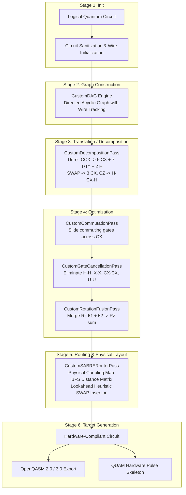

# 🌌 QuantumForge: From-Scratch Quantum Circuit Transpiler Engine

<div align="center">

[](https://python.org)
[](https://qiskit.org)
[](LICENSE)
[](tests/)
[](#-the-6-stage-transpiler-architecture)

**An open-source, from-scratch quantum circuit transpiler engine inspired by Qiskit's internal compiler architecture. Built for education, research, and extensible compiler design without black-box dependency.**

[Why This Project?](#-why-this-project) •
[Core Transpiler Architecture](#-the-6-stage-transpiler-architecture) •
[How It Works Under the Hood](#-how-it-works-under-the-hood) •
[Quickstart](#-quickstart) •
[Interactive Examples](#-interactive-walkthroughs) •
[Extending the Transpiler](#-how-to-write-your-own-custom-pass) •
[Contributing](#-contributing--open-source-roadmap)

</div>

---

## 💡 Why This Project?

Most quantum developers use `qiskit.transpile(circuit, optimization_level=3)` as a black box. Behind that single function call lies an intricate software compiler with graph representations, heuristic graph mapping algorithms, algebraic simplification rules, and hardware noise mitigation techniques.

**QuantumForge** re-implements the complete core conceptual architecture of Qiskit's transpiler from the ground up in pure, readable Python:
- **No black-box calls** to Qiskit transpiler passes (`generate_preset_pass_manager`, `CXCancellation`, or Rustworkx routing).
- **Pure algorithmic implementations**: Custom DAG graph engine, topological layer analysis, algebraic inverse cancellation, continuous rotation fusion, commutation rules, canonical Barenco gate unrolling, and SABRE heuristic lookahead routing.
- **Interoperable with the quantum ecosystem**: Ingests and outputs standard quantum circuits, OpenQASM 2.0/3.0, and QUAM (Quantum Machines) execution skeletons.

---

## 🏗️ The 6-Stage Transpiler Architecture

Qiskit's transpiler organizes compilation into 6 modular stages. QuantumForge implements this exact multi-stage model:



---

## 🔍 How It Works Under the Hood

### 1. The Custom DAG Graph Engine (`CustomDAG`)
Standard circuit arrays (lists of instructions) make it difficult to inspect gate independence. QuantumForge transforms circuits into Directed Acyclic Graphs:
- **`DAGNode`**: Represents a discrete operation, input wire, or output wire.
- **Wire Splicing**: Directed edges represent causality along specific qubit lines ($q_0, q_1, \dots$).
- **Node Removal with Edge Splicing**: When a gate pair cancels, the incoming predecessor edges are spliced directly to the outgoing successor edges in $\mathcal{O}(1)$ time per wire.
- **Critical Path Calculation**: Computes circuit depth by finding the longest path from any input node to an output node.

```python
from quantum_optimizer.transpiler import CustomDAG

dag = CustomDAG.from_circuit(circuit)
print(f"Total Op Nodes: {len(dag.op_nodes())}")
print(f"Critical Path Depth: {dag.depth()}")
```

### 2. Algebraic Gate Cancellation (`CustomGateCancellationPass`)
Traverses adjacent operations along every qubit wire and eliminates mathematical identities:
- **Self-Inverse Gates**:
  $$H \cdot H = I, \quad X \cdot X = I, \quad Y \cdot Y = I, \quad Z \cdot Z = I$$
  $$CX(c, t) \cdot CX(c, t) = I, \quad \text{SWAP} \cdot \text{SWAP} = I$$
- **Adjoint Inverse Pairs**:
  $$T \cdot T^\dagger = I, \quad S \cdot S^\dagger = I$$
- **Terminal Redundant Rotations**:
  $$U(\pi, 0, \pi) \cdot U(\pi, 0,\pi) = X \cdot X = I$$

### 3. Continuous Rotation Fusion (`CustomRotationFusionPass`)
Quantum gates parameterized by angles around the same rotation axis combine linearly:
$$R_z(\theta_1) \cdot R_z(\theta_2) = R_z(\theta_1 + \theta_2)$$
If $(\theta_1 + \theta_2) \pmod{2\pi} \approx 0$, both nodes are eliminated from the DAG as an effective Identity gate.

### 4. Commutation Analysis (`CustomCommutationPass`)
Gates that commute can slide past each other along wires, unlocking cancellations that were previously blocked:
- $Z, R_z, S, T$ commute with $CX$ on the **control** qubit.
- $X, R_x$ commute with $CX$ on the **target** qubit.
- Consecutive $CX(c, t_1)$ and $CX(c, t_2)$ sharing the same control qubit commute.

### 5. Custom SABRE SWAP Routing (`CustomSABRERouterPass`)
Physical quantum computers (e.g. superconducting transmon processors) only allow two-qubit interactions between physically connected qubits defined by a **coupling map**.

QuantumForge implements the **SABRE** (SWAP-Based Bidirectional Heuristic Search) algorithm from scratch:

$$\text{Cost}(S) = \frac{1}{|F|} \sum_{(u, v) \in F} D(\pi(u), \pi(v)) + W \cdot \frac{1}{|E|} \sum_{(u, v) \in E} D(\pi(u), \pi(v))$$

Where:
- $\pi(l)$ is the mapping of logical qubit $l$ to physical qubit $p$.
- $D(p_1, p_2)$ is the shortest path distance matrix calculated via Breadth-First Search (BFS) over the processor coupling graph.
- $F$ is the **Front Layer** of currently blocked two-qubit gates.
- $E$ is the **Extended Lookahead Window** of downstream gates.
- $W$ is the lookahead weighting parameter ($0.5$ default).
- Dynamic decay factors $\delta(p)$ are applied to recently swapped qubits to break symmetry and prevent infinite ping-pong livelocks.

---

## 🚀 Quickstart

### Prerequisites
- Python 3.10, 3.11, or 3.12
- [uv](https://github.com/astral-sh/uv) (recommended) or standard `pip`

### Installation
```bash
# Clone the open-source repository
git clone https://github.com/Babin123456/Quantum-Circuit-Optimizer.git
cd Quantum-Circuit-Optimizer

# Create and activate Python 3.12 environment
uv venv --python 3.12 .venv
# On Windows: .venv\Scripts\activate
# On Linux/macOS: source .venv/bin/activate

# Install dependencies and local package in editable mode
uv pip install -r requirements.txt
uv pip install -e .
```

### Basic Usage (High-Level API)
```python
from qiskit import QuantumCircuit
from quantum_optimizer import QuantumOptimizer, compare_circuits

# Create circuit with redundant operations
qc = QuantumCircuit(2)
qc.h(0)
qc.h(0)        # Cancels: H * H = I
qc.cx(0, 1)

# Transpile using our custom engine (Level 2: cancellation + fusion + commutation)
optimizer = QuantumOptimizer(optimization_level=2)
optimized_qc = optimizer.optimize(qc)

# Inspect metrics
metrics = compare_circuits(qc, optimized_qc)
print(f"Depth reduction: {metrics['depth_reduction_pct']}%")
print(f"Gate count reduction: {metrics['gate_reduction_pct']}%")
```

---

## 💻 Interactive Walkthroughs

The repository contains 4 self-contained educational examples in `examples/`:

### Example 1: Basic Optimization & Gate Cancellation
```bash
uv run python examples/01_basic_optimization.py
```
*Creates deliberate self-inverses ($H-H, X-X, CX-CX$), runs across Levels 0–3, and outputs comparative depth/gate count tables.*

### Example 2: Toffoli Gate Decomposition & Cancellation
```bash
uv run python examples/02_toffoli_decomposition.py
```
*Decomposes a 3-qubit Toffoli gate into 6 CX gates + single-qubit rotations, removes redundant $U(\pi,0,\pi)$ gates, and proves mathematical equivalence with $F = 1.000000$ Statevector Fidelity.*

### Example 3: Hardware Topology & SABRE Routing
```bash
uv run python examples/03_sabre_hardware_routing.py
```
*Defines a 1D linear physical architecture ($0 \leftrightarrow 1 \leftrightarrow 2 \leftrightarrow 3 \leftrightarrow 4$), takes a logical circuit with non-adjacent gates, and routes it using our custom SABRE heuristic algorithm.*

### Example 4: OpenQASM 2.0, 3.0 & QUAM Export
```bash
uv run python examples/04_qasm_export.py
```
*Compiles the circuit and exports it to OpenQASM 2.0 (`output/circuit_optimized.qasm`), OpenQASM 3.0 (`output/circuit_optimized.qasm3`), and a Quantum Machines QUAM hardware configuration.*

---

## 🛠️ How to Write Your Own Custom Pass

One of the main advantages of QuantumForge is how simple it is to write and plug in your own compiler pass.

### Example: Creating a Custom Logging Pass
```python
from quantum_optimizer.transpiler import AnalysisPass, CustomPassManager

class CircuitAuditPass(AnalysisPass):
    """Custom pass that audits two-qubit gate counts."""
    
    def name(self) -> str:
        return "CircuitAuditPass"

    def run(self, dag) -> None:
        two_q_count = sum(1 for node in dag.op_nodes() if len(node.qubits) >= 2)
        print(f"[Audit] Circuit currently has {two_q_count} two-qubit gates.")
        # Store in shared blackboard for subsequent passes to read
        self.property_set["audit_2q_count"] = two_q_count

# Register and execute in pass manager
pm = CustomPassManager([
    CircuitAuditPass(),
])
pm.run(circuit)
```

---

## 📦 Directory Structure

```
Quantum-Circuit-Optimizer/
├── src/quantum_optimizer/
│   ├── transpiler/                 # 🚀 CORE FROM-SCRATCH TRANSPILER ENGINE
│   │   ├── base.py                 # BasePass, AnalysisPass, TransformationPass, PropertySet
│   │   ├── dag.py                  # CustomDAG & DAGNode graph representation
│   │   ├── pass_manager.py         # CustomPassManager pipeline & loop scheduler
│   │   └── passes/                 # INDIVIDUAL COMPILER PASSES
│   │       ├── cancellation.py     # CustomGateCancellationPass (H-H, CX-CX, U-U)
│   │       ├── fusion.py           # CustomRotationFusionPass (Rz, Rx, Ry angle sums)
│   │       ├── commutation.py      # CustomCommutationPass (commutation rules)
│   │       ├── decomposition.py    # CustomDecompositionPass (Toffoli, SWAP, CZ unrolling)
│   │       └── sabre_router.py     # CustomSABRERouterPass (SABRE heuristic lookahead)
│   ├── optimizer.py                # High-level QuantumOptimizer facade (Levels 0 - 3)
│   ├── dag_utils.py                # DAG inspection, critical path, parallelism analysis
│   ├── decomposition.py            # Canonical Toffoli & test circuit generators
│   ├── routing.py                  # Coupling map builders (Linear, Ring, Star)
│   ├── metrics.py                  # Depth, gate count %, and component noise fidelity
│   └── qasm_export.py              # OpenQASM 2.0 / 3.0 & QUAM exporters
├── examples/                       # 4 executable educational walkthrough scripts
├── tests/                          # 17 comprehensive unit tests (all passing)
├── output/                         # Generated .qasm and .qasm3 compilation artifacts
├── requirements.txt                # Python package dependencies
├── setup.py                        # Pip packaging configuration
└── README.md                       # Documentation & open-source guide
```

---

## 🧪 Testing

Run the full automated test suite using `pytest`:

```bash
uv run pytest -v
```

All 17 unit tests execute in ~3.5s and verify:
- Exact unitary equivalence (`Operator.equiv == True`)
- DAG wire splicing and edge integrity
- Redundant gate elimination
- Continuous angle rotation fusion modulo $2\pi$
- Physical coupling map satisfaction under SABRE routing

---

## 🤝 Contributing & Open-Source Roadmap

Contributions are welcome! If you want to contribute, here are great areas to explore:

- [ ] **AI-Guided MCTS Routing**: Implement Monte Carlo Tree Search for minimum-SWAP routing.
- [ ] **Direct QUA Pulse Generator**: Generate pulse-level Python code targeting Quantum Machines OPX hardware.
- [ ] **Commutation Table Extensions**: Add multi-controlled gate commutation rules.
- [ ] **Hardware Noise Ingestion**: Pull live calibration JSON from IBM Quantum backends to weight the SABRE cost by coupler error rate.

### How to Contribute:
1. Fork the Project (`https://github.com/Babin123456/Quantum-Circuit-Optimizer`)
2. Create your Feature Branch (`git checkout -b feature/NewCompilerPass`)
3. Commit your Changes (`git commit -m 'feat: add NewCompilerPass'`)
4. Push to the Branch (`git push origin feature/NewCompilerPass`)
5. Open a Pull Request

---

## 📄 License

Distributed under the Apache License 2.0. See `LICENSE` for more information.
