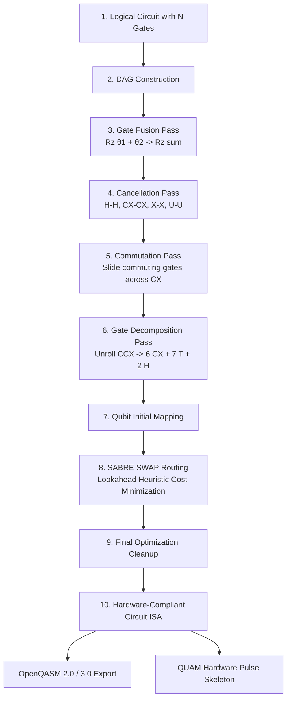

# 🌌 QuantumForge: From-Scratch Quantum Circuit Transpiler Engine

<div align="center">

[](https://python.org)
[](https://qiskit.org)
[](LICENSE)
[](tests/)
[](#-the-exact-8-stage-transpiler-pipeline)

**An open-source, from-scratch quantum circuit transpiler engine built on the foundational principles of quantum compilation. Optimizes circuits with arbitrary $N$ qubits and $N$ gates without relying on Qiskit's internal optimization passes.**

[Why This Project?](#-why-this-project) •
[Step-by-Step Setup](#-step-by-step-setup--execution-guide) •
[The 8-Stage Pipeline](#-the-exact-8-stage-transpiler-pipeline) •
[One-Line Transpilation](#-transpile-any-circuit-in-one-function-call) •
[Running All Examples](#-run-all-examples-step-by-step) •
[Verification & Tests](#-run-automated-tests) •
[Module Breakdown](#-module-breakdown)

</div>

---

## 💡 Why This Project?

Most quantum developers use `qiskit.transpile(circuit, optimization_level=3)` as a black box. Behind that single function call lies an intricate software compiler: Directed Acyclic Graphs (DAG), algebraic simplification, continuous rotation fusion, commutation reordering, and heuristic physical processor SWAP routing.

**QuantumForge** builds this complete conceptual architecture from the ground up:
- **No black-box calls** to Qiskit's internal transpiler passes (`generate_preset_pass_manager`, `CXCancellation`, `SabreSwap`).
- **100% custom algorithms**: Custom pure-Python DAG graph engine, algebraic gate cancellation, continuous rotation fusion modulo $2\pi$, commutation analysis, textbook Barenco Toffoli decomposition, and the SABRE heuristic lookahead routing algorithm.
- **Interoperable**: Ingests standard quantum circuits, outputs hardware-compliant circuits, OpenQASM 2.0 / 3.0 files, and Quantum Machines QUAM architecture skeletons.

---

## 🚀 Step-by-Step Setup & Execution Guide

Follow these exact steps to set up your environment and run all tests and examples without errors:

### Step 1: Clone the Repository
```bash
git clone https://github.com/Babin123456/Quantum-Circuit-Optimizer.git
cd Quantum-Circuit-Optimizer
```

### Step 2: Create a Clean Python 3.12 Virtual Environment
Quantum computing packages like Qiskit 2.x and NumPy are compiled for Python 3.10 through 3.12. Using `uv` (recommended) guarantees a clean, isolated environment:

```bash
# Using uv (fastest & recommended)
uv venv --python 3.12 .venv

# Activate environment:
# On Windows PowerShell:
.venv\Scripts\activate
# On Linux / macOS:
source .venv/bin/activate
```

*(If using standard Python without uv: `py -3.12 -m venv .venv` followed by activation).*

### Step 3: Install Dependencies and Local Package
```bash
uv pip install -r requirements.txt
uv pip install -e .
```

---

## 🏗️ The Exact 8-Stage Transpiler Pipeline

When an arbitrary circuit of $N$ qubits and $N$ gates is submitted, QuantumForge processes it through the following pipeline:



---

## ⚡ Transpile Any Circuit in One Function Call

You can optimize any circuit of arbitrary size with a single function call using `transpile_circuit`:

```python
from qiskit import QuantumCircuit
from quantum_optimizer import transpile_circuit

# 1. Build any circuit with N qubits and N gates
qc = QuantumCircuit(4)
qc.h(0)
qc.h(0)          # Cancels: H * H = I
qc.ccx(0, 1, 2)  # Decomposed into 6 CX gates
qc.cx(0, 3)      # Non-adjacent: routed with physical SWAPs

# 2. Transpile in 1 line of code!
hardware_qc, metrics = transpile_circuit(
    circuit=qc,
    coupling_map=[[0, 1], [1, 2], [2, 3]],  # Any hardware coupling graph
    export_qasm=True,                       # Automatically saves .qasm & .qasm3
    qasm_filename="output/my_hardware_circuit",
    generate_quam=True,                     # Generates Quantum Machines QUAM skeleton
    verbose=True                            # Prints live step-by-step progress
)
```

---

## 💻 Run All Examples Step-by-Step

All 5 executable walkthrough scripts are located in `examples/`. Run them one by one:

### 1. Master Transpiler Pipeline (The 8-Stage Engine)
```bash
uv run python examples/05_master_transpile_function.py
```
- **What it does**: Takes an arbitrary multi-qubit circuit with rotations, Toffoli gates, and distant interactions; runs through all 8 stages; outputs ASCII circuits before/after, depth/gate count metrics, OpenQASM files, and a QUAM skeleton.

### 2. Basic Optimization & Gate Cancellation
```bash
uv run python examples/01_basic_optimization.py
```
- **What it does**: Demonstrates algebraic cancellation ($H\cdot H \to I$, $X\cdot X \to I$, $CX\cdot CX \to I$) and compares optimization levels 0, 1, 2, and 3.

### 3. Toffoli Gate Decomposition & Redundancy Cancellation
```bash
uv run python examples/02_toffoli_decomposition.py
```
- **What it does**: Unrolls a 3-qubit Toffoli gate into 6 CX gates, cancels terminal redundant $U(\pi,0,\pi) \cdot U(\pi,0,\pi) = X \cdot X = I$ gates, and verifies exact unitary equivalence with Statevector Fidelity $F = 1.000000$.

### 4. Hardware Topology & SABRE Routing
```bash
uv run python examples/03_sabre_hardware_routing.py
```
- **What it does**: Maps an unconstrained circuit onto a 5-qubit 1D linear chain ($0 \leftrightarrow 1 \leftrightarrow 2 \leftrightarrow 3 \leftrightarrow 4$) using the SABRE lookahead cost function to insert SWAP gates.

### 5. OpenQASM 2.0, 3.0 & QUAM Export
```bash
uv run python examples/04_qasm_export.py
```
- **What it does**: Compiles a circuit and generates `.qasm` (OpenQASM 2.0), `.qasm3` (OpenQASM 3.0), and a JSON configuration for Quantum Machines OPX hardware controllers.

---

## 🧪 Run Automated Tests

Execute the complete test suite to verify graph operations, gate cancellations, unitary preservation, and routing correctness:

```bash
uv run pytest -v
```

**Expected output:**
```
============================= 19 passed in 1.86s =============================
```

---

## 📦 Module Breakdown

| File | Primary Class / Function | Purpose |
| :--- | :--- | :--- |
| **`transpile.py`** | `transpile_circuit(...)` | **The Master Function**: Executes the full 8-stage pipeline from Logical Circuit to Hardware ISA. |
| **`transpiler/base.py`** | `BasePass`, `TransformationPass`, `AnalysisPass`, `PropertySet` | Modular compiler pass infrastructure & shared blackboard state. |
| **`transpiler/dag.py`** | `CustomDAG`, `DAGNode` | Pure-Python Directed Acyclic Graph engine with $\mathcal{O}(1)$ wire splicing. |
| **`transpiler/pass_manager.py`** | `CustomPassManager` | Schedules compiler passes and executes fixed-point convergence loops. |
| **`transpiler/passes/cancellation.py`** | `CustomGateCancellationPass` | Deletes adjacent self-inverses ($H\cdot H$, $CX\cdot CX$, $U\cdot U$) and adjoints ($T\cdot T^\dagger$). |
| **`transpiler/passes/fusion.py`** | `CustomRotationFusionPass` | Fuses continuous rotations ($R_z(\theta_1) + R_z(\theta_2)$) modulo $2\pi$. |
| **`transpiler/passes/commutation.py`** | `CustomCommutationPass` | Slides commuting gates past $CX$ controls/targets to unlock hidden cancellation pairs. |
| **`transpiler/passes/decomposition.py`** | `CustomDecompositionPass` | Canonical gate unrolling ($CCX \to 6\ CX + 7\ T + 2\ H$, $SWAP \to 3\ CX$, $CZ \to H\cdot CX\cdot H$). |
| **`transpiler/passes/sabre_router.py`** | `CustomSABRERouterPass` | SABRE heuristic lookahead routing minimizing distance matrix on the coupling map. |
| **`metrics.py`** | `CircuitMetrics`, `compare_circuits` | Depth reduction %, gate count diffs, and hardware noise fidelity estimation. |
| **`qasm_export.py`** | `QASMExporter` | Dual export to OpenQASM 2.0, OpenQASM 3.0, and QUAM hardware JSON. |

---

## 📄 License

Distributed under the Apache License 2.0. See `LICENSE` for more details.
