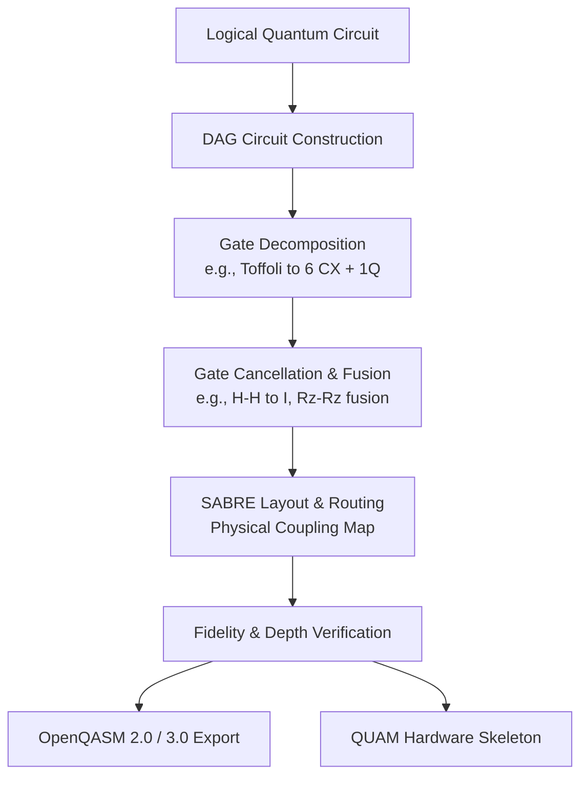

# ⚡ Quantum Circuit Optimizer

<div align="center">


**A modular, educational, and production-ready Python framework for quantum circuit optimization, DAG dependency analysis, gate decomposition, SABRE hardware routing, and OpenQASM / QUAM compilation.**

[Features](#-key-features) •
[Quickstart](#-quickstart) •
[Architecture](#-architecture--workflow) •
[Interactive Examples](#-run-interactive-examples) •
[Modules](#-module-breakdown) •
[Roadmap](#-future-roadmap)

</div>

---

## 🌟 Key Features

- **Multi-Level Circuit Optimization**: Seamlessly compile and simplify circuits across levels 0, 1, 2, and 3 (gate cancellation, 1Q consolidation, commutation, and unitary synthesis).
- **DAG Circuit Analysis**: Inspect Directed Acyclic Graphs (DAG), critical paths, node dependencies, layer parallelism scores, and execution bottlenecks.
- **Hardware-Aware Gate Decomposition**: Decompose composite multi-qubit gates (Toffoli / CCX, Fredkin / CSWAP) down to hardware-native basis gates ({CX, SX, RZ}) with mathematical equivalence verification.
- **SABRE SWAP Routing**: Physical processor topology mapping (Linear, Ring, Star, Heavy-Hex) using heuristic bidirectional lookahead search.
- **Fidelity & Metric Analytics**: Depth reduction %, gate count diffs, and hardware fidelity estimation based on component gate noise models.
- **OpenQASM & QUAM Export**: Dual export to OpenQASM 2.0 and OpenQASM 3.0, with a hardware mapping skeleton for Quantum Machines QUAM.

---

## 🏗️ Architecture & Workflow

The optimization pipeline follows modern Qiskit transpilation paradigms:



---

## 🚀 Quickstart

### 1. Installation

Clone this repository and set up your Python environment:

```bash
git clone https://github.com/Babin123456/Quantum-Circuit-Optimizer.git
cd Quantum-Circuit-Optimizer

# Create virtual environment (Python 3.10 - 3.12 recommended)
python -m venv .venv
source .venv/bin/activate  # On Windows: .venv\Scripts\activate

# Install package and dependencies
pip install -r requirements.txt
pip install -e .
```

### 2. Optimize in 5 Lines of Code

```python
from qiskit import QuantumCircuit
from quantum_optimizer import QuantumOptimizer, compare_circuits

# Create circuit with redundant operations
qc = QuantumCircuit(2)
qc.h(0)
qc.h(0)        # Cancels: H * H = I
qc.cx(0, 1)

# Optimize circuit
optimizer = QuantumOptimizer(optimization_level=2)
optimized_qc = optimizer.optimize(qc)

# Inspect reductions
metrics = compare_circuits(qc, optimized_qc)
print(f"Depth reduction: {metrics['depth_reduction_pct']}%")
print(f"Gate count reduction: {metrics['gate_reduction_pct']}%")
```

---

## 💻 Run Interactive Examples

The repository includes ready-to-run educational scripts in `examples/`:

### Example 1: Basic Optimization & Gate Cancellation
```bash
python examples/01_basic_optimization.py
```
*Demonstrates single-qubit gate cancellation, 2-qubit CX cancellation, and multi-level comparison.*

### Example 2: Toffoli Gate Decomposition
```bash
python examples/02_toffoli_decomposition.py
```
*Recreates canonical 6-CX Toffoli decomposition, removes adjacent redundant rotations, and computes statevector fidelity.*

### Example 3: Hardware Topology & SABRE Routing
```bash
python examples/03_sabre_hardware_routing.py
```
*Maps an unconstrained circuit onto a 5-qubit 1D linear chain coupling map using SABRE heuristic SWAP insertion.*

### Example 4: OpenQASM 2.0, 3.0 & QUAM Export
```bash
python examples/04_qasm_export.py
```
*Exports optimized circuits to standard OpenQASM files and generates a Quantum Machines QUAM configuration skeleton.*

---

## 📦 Module Breakdown

| Module | Core Class / Method | Description |
| :--- | :--- | :--- |
| `optimizer.py` | `QuantumOptimizer` | Multi-level preset transpiler, custom cancellation pipelines, level comparison. |
| `dag_utils.py` | `DAGAnalyzer` | DAG inspection, critical path finding, parallelism scoring, layer extraction. |
| `decomposition.py` | `Decomposer` | Multi-qubit decomposition to basis gates; canonical 6-CX Toffoli construction. |
| `routing.py` | `SABRERouter` | Topology generation (Linear, Ring, Star) & SABRE SWAP heuristic routing. |
| `metrics.py` | `CircuitMetrics` | Depth reduction, gate diffs, estimated hardware success fidelity. |
| `qasm_export.py` | `QASMExporter` | OpenQASM 2.0 / 3.0 serialization and QUAM machine skeleton generation. |

---

## 🧪 Testing

Run the full automated test suite using `pytest`:

```bash
pytest -v
```

---

## 🗺️ Future Roadmap

- [ ] **Direct QUAM / QUA Pulse Generator**: Translate OpenQASM 3.0 timing blocks into QUA pulse play instructions.
- [ ] **AI-Guided Circuit Routing**: Integrate reinforcement learning / MCTS agent for minimum-SWAP search.
- [ ] **Dynamic Noise-Aware Layout**: Ingest live calibration data from IBM Quantum hardware backends to place 2Q gates on the lowest-error physical couplers.

---

## 📄 License

This project is licensed under the Apache License 2.0.
